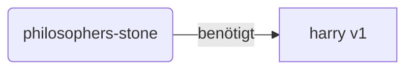
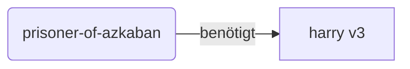
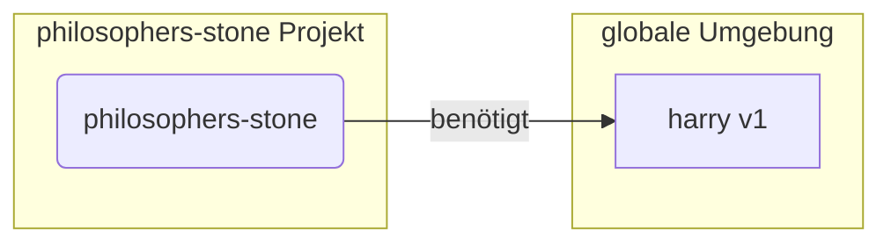
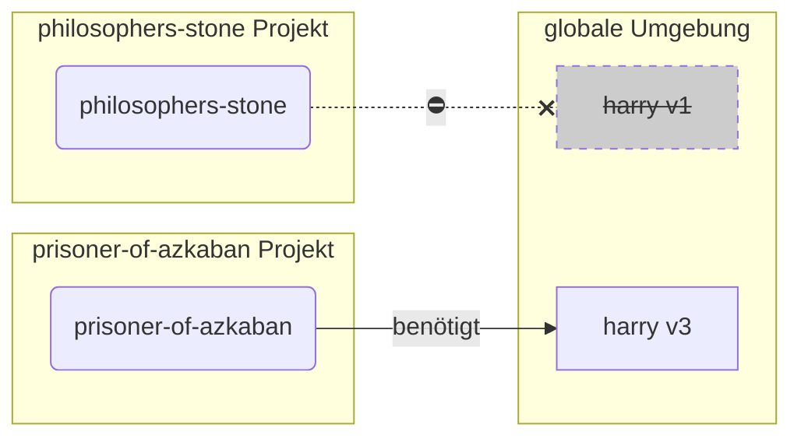
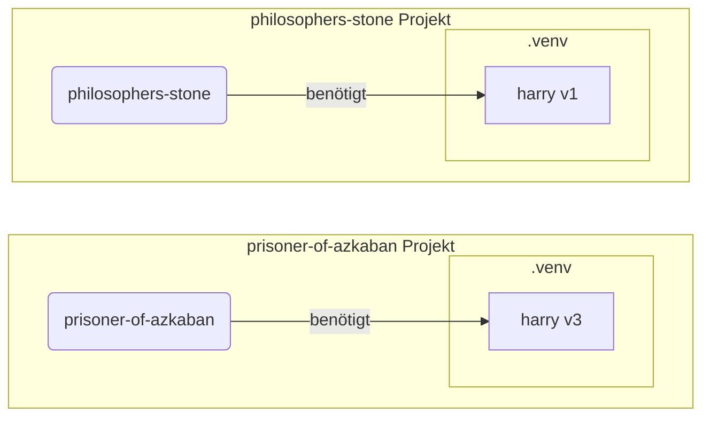

# <a id="virtual-environments"></a> Virtuelle Umgebungen

Wenn Sie an Python-Projekten arbeiten, sollten Sie wahrscheinlich eine **virtuelle Umgebung** (oder einen ähnlichen Mechanismus) verwenden, um die Pakete (englisch: Packages), die Sie für jedes Projekt installieren, zu isolieren.

/// info | Info

Wenn Sie bereits über virtuelle Umgebungen Bescheid wissen, wie man sie erstellt und verwendet, möchten Sie diesen Abschnitt vielleicht überspringen. 🤓

///

/// tip | Tipp

Eine **virtuelle Umgebung** unterscheidet sich von einer **Umgebungsvariable**.

Eine **Umgebungsvariable** ist eine Variable im System, die von Programmen verwendet werden kann.

Eine **virtuelle Umgebung** ist ein Verzeichnis mit einigen Dateien darin.

///

/// info | Info

Diese Seite wird Ihnen beibringen, wie Sie **virtuelle Umgebungen** verwenden und wie sie funktionieren.

Wenn Sie bereit sind, ein **Tool zu verwenden, das alles für Sie verwaltet** (einschließlich der Installation von Python), probieren Sie <a href="https://github.com/astral-sh/uv" class="external-link" target="_blank">uv</a>.

///

## <a id="create-a-project"></a> Ein Projekt erstellen

Erstellen Sie zuerst ein Verzeichnis für Ihr Projekt.

Was ich normalerweise mache, ist, dass ich ein Verzeichnis namens `code` in meinem Home/Benutzerverzeichnis erstelle.

Und darin erstelle ich ein Verzeichnis pro Projekt.

<div class="termy">

```console
// Zum Home-Verzeichnis wechseln
$ cd
// Ein Verzeichnis für alle Ihre Codeprojekte erstellen
$ mkdir code
// In dieses Codeverzeichnis gehen
$ cd code
// Ein Verzeichnis für dieses Projekt erstellen
$ mkdir awesome-project
// In dieses Projektverzeichnis gehen
$ cd awesome-project
```

</div>

## <a id="create-a-virtual-environment"></a> Eine virtuelle Umgebung erstellen

Wenn Sie zum **ersten Mal** an einem Python-Projekt arbeiten, erstellen Sie eine virtuelle Umgebung **<abbr title="Es gibt andere Optionen, dies ist eine einfache Richtlinie">innerhalb Ihres Projekts</abbr>**.

/// tip | Tipp

Sie müssen dies nur **einmal pro Projekt** tun, nicht jedes Mal, wenn Sie daran arbeiten.

///

//// tab | `venv`

Um eine virtuelle Umgebung zu erstellen, können Sie das `venv`-Modul verwenden, das mit Python geliefert wird.

<div class="termy">

```console
$ python -m venv .venv
```

</div>

/// details | Was dieser Befehl bedeutet

* `python`: das Programm namens `python` verwenden
* `-m`: ein Modul als Skript aufrufen, wir geben als nächstes an, welches Modul
* `venv`: das Modul namens `venv` verwenden, das normalerweise mit Python installiert wird
* `.venv`: die virtuelle Umgebung im neuen Verzeichnis `.venv` erstellen

///

////

//// tab | `uv`

Wenn Sie <a href="https://github.com/astral-sh/uv" class="external-link" target="_blank">`uv`</a> installiert haben, können Sie es verwenden, um eine virtuelle Umgebung zu erstellen.

<div class="termy">

```console
$ uv venv
```

</div>

/// tip | Tipp

Standardmäßig erstellt `uv` eine virtuelle Umgebung in einem Verzeichnis namens `.venv`.

Aber Sie könnten es anpassen, indem Sie ein zusätzliches Argument mit dem Verzeichnisnamen übergeben.

///

////

Dieser Befehl erstellt eine neue virtuelle Umgebung in einem Verzeichnis namens `.venv`.

/// details | `.venv` oder ein anderer Name

Sie könnten die virtuelle Umgebung in einem anderen Verzeichnis erstellen, aber es ist eine Konvention, sie `.venv` zu nennen.

///

## <a id="activate-the-virtual-environment"></a> Die virtuelle Umgebung aktivieren

Aktivieren Sie die neue virtuelle Umgebung, damit jeder Python-Befehl, den Sie ausführen, oder jedes Paket, das Sie installieren, diese Umgebung verwendet.

/// tip | Tipp

Tun Sie dies **jedes Mal**, wenn Sie eine **neue Terminalsitzung** starten, um an dem Projekt zu arbeiten.

///

//// tab | Linux, macOS

<div class="termy">

```console
$ source .venv/bin/activate
```

</div>

////

//// tab | Windows PowerShell

<div class="termy">

```console
$ .venv\Scripts\Activate.ps1
```

</div>

////

//// tab | Windows Bash

Oder wenn Sie Bash für Windows verwenden (z.B. <a href="https://gitforwindows.org/" class="external-link" target="_blank">Git Bash</a>):

<div class="termy">

```console
$ source .venv/Scripts/activate
```

</div>

////

/// tip | Tipp

Jedes Mal, wenn Sie ein **neues Paket** in dieser Umgebung installieren, aktivieren Sie die Umgebung erneut.

So stellen Sie sicher, dass, wenn Sie ein **Terminalprogramm (<abbr title="Command Line Interface">CLI</abbr>)** verwenden, das durch dieses Paket installiert wurde, Sie das aus Ihrer virtuellen Umgebung verwenden und nicht eines, das global installiert ist, wahrscheinlich mit einer anderen Version als der, die Sie benötigen.

///

## <a id="check-the-virtual-environment-is-active"></a> Überprüfen, ob die virtuelle Umgebung aktiv ist

Überprüfen Sie, dass die virtuelle Umgebung aktiv ist (der vorherige Befehl funktioniert hat).

/// tip | Tipp

Dies ist **optional**, aber es ist eine gute Möglichkeit, **zu überprüfen**, ob alles wie erwartet funktioniert und Sie die beabsichtigte virtuelle Umgebung verwenden.

///

//// tab | Linux, macOS, Windows Bash

<div class="termy">

```console
$ which python

/home/user/code/awesome-project/.venv/bin/python
```

</div>

Wenn es das `python`-Binary in `.venv/bin/python` anzeigt, innerhalb Ihres Projekts (in diesem Fall `awesome-project`), dann hat es funktioniert. 🎉

////

//// tab | Windows PowerShell

<div class="termy">

```console
$ Get-Command python

C:\Users\user\code\awesome-project\.venv\Scripts\python
```

</div>

Wenn es das `python`-Binary in `.venv\Scripts\python` anzeigt, innerhalb Ihres Projekts (in diesem Fall `awesome-project`), dann hat es funktioniert. 🎉

////

## <a id="upgrade-pip"></a> `pip` aktualisieren

/// tip | Tipp

Wenn Sie <a href="https://github.com/astral-sh/uv" class="external-link" target="_blank">`uv`</a> verwenden, würden Sie das verwenden, um Dinge zu installieren anstelle von `pip`, sodass Sie `pip` nicht aktualisieren müssen. 😎

///

Wenn Sie `pip` verwenden, um Pakete zu installieren (es wird standardmäßig mit Python geliefert), sollten Sie es auf die neueste Version **aktualisieren**.

Viele exotische Fehler beim Installieren eines Pakets werden einfach dadurch gelöst, dass zuerst `pip` aktualisiert wird.

/// tip | Tipp

Normalerweise würden Sie dies **einmal** tun, unmittelbar nachdem Sie die virtuelle Umgebung erstellt haben.

///

Stellen Sie sicher, dass die virtuelle Umgebung aktiv ist (mit dem obigen Befehl) und führen Sie dann aus:

<div class="termy">

```console
$ python -m pip install --upgrade pip

---> 100%
```

</div>

## <a id="add-gitignore"></a> `.gitignore` hinzufügen

Wenn Sie **Git** verwenden (was Sie sollten), fügen Sie eine `.gitignore`-Datei hinzu, um alles in Ihrem `.venv` von Git auszuschließen.

/// tip | Tipp

Wenn Sie <a href="https://github.com/astral-sh/uv" class="external-link" target="_blank">`uv`</a> verwendet haben, um die virtuelle Umgebung zu erstellen, hat es dies bereits für Sie getan, Sie können diesen Schritt überspringen. 😎

///

/// tip | Tipp

Tun Sie dies **einmal**, unmittelbar nachdem Sie die virtuelle Umgebung erstellt haben.

///

<div class="termy">

```console
$ echo "*" > .venv/.gitignore
```

</div>

/// details | Was dieser Befehl bedeutet

* `echo "*"`: wird den Text `*` im Terminal „drucken“ (der nächste Teil ändert das ein wenig)
* `>`: alles, was durch den Befehl links von `>` im Terminal ausgegeben wird, sollte nicht gedruckt, sondern stattdessen in die Datei geschrieben werden, die rechts von `>` kommt
* `.gitignore`: der Name der Datei, in die der Text geschrieben werden soll

Und `*` bedeutet für Git „alles“. Also wird alles im `.venv`-Verzeichnis ignoriert.

Dieser Befehl erstellt eine Datei `.gitignore` mit dem Inhalt:

```gitignore
*
```

///

## <a id="install-packages"></a> Pakete installieren

Nachdem Sie die Umgebung aktiviert haben, können Sie Pakete darin installieren.

/// tip | Tipp

Tun Sie dies **einmal**, wenn Sie die Pakete installieren oder aktualisieren, die Ihr Projekt benötigt.

Wenn Sie eine Version aktualisieren oder ein neues Paket hinzufügen müssen, würden Sie **dies erneut tun**.

///

### <a id="install-packages-directly"></a> Pakete direkt installieren

Wenn Sie es eilig haben und keine Datei verwenden möchten, um die Paketanforderungen Ihres Projekts zu deklarieren, können Sie sie direkt installieren.

/// tip | Tipp

Es ist eine (sehr) gute Idee, die Pakete und Versionen, die Ihr Programm benötigt, in einer Datei zu speichern (zum Beispiel `requirements.txt` oder `pyproject.toml`).

///

//// tab | `pip`

<div class="termy">

```console
$ pip install "fastapi[standard]"

---> 100%
```

</div>

////

//// tab | `uv`

Wenn Sie <a href="https://github.com/astral-sh/uv" class="external-link" target="_blank">`uv`</a> haben:

<div class="termy">

```console
$ uv pip install "fastapi[standard]"
---> 100%
```

</div>

////

### <a id="install-from-requirements-txt"></a> Installation von `requirements.txt`

Wenn Sie eine `requirements.txt` haben, können Sie diese nun verwenden, um deren Pakete zu installieren.

//// tab | `pip`

<div class="termy">

```console
$ pip install -r requirements.txt
---> 100%
```

</div>

////

//// tab | `uv`

Wenn Sie <a href="https://github.com/astral-sh/uv" class="external-link" target="_blank">`uv`</a> haben:

<div class="termy">

```console
$ uv pip install -r requirements.txt
---> 100%
```

</div>

////

/// details | `requirements.txt`

Eine `requirements.txt` mit einigen Paketen könnte folgendermaßen aussehen:

```requirements.txt
fastapi[standard]==0.113.0
pydantic==2.8.0
```

///

## <a id="run-your-program"></a> Ihr Programm ausführen

Nachdem Sie die virtuelle Umgebung aktiviert haben, können Sie Ihr Programm ausführen, und es wird das Python innerhalb Ihrer virtuellen Umgebung mit den Paketen verwenden, die Sie dort installiert haben.

<div class="termy">

```console
$ python main.py

Hello World
```

</div>

## <a id="configure-your-editor"></a> Ihren Editor konfigurieren

Sie würden wahrscheinlich einen Editor verwenden, stellen Sie sicher, dass Sie ihn so konfigurieren, dass er die gleiche virtuelle Umgebung verwendet, die Sie erstellt haben (er wird sie wahrscheinlich automatisch erkennen), sodass Sie Autovervollständigungen und Inline-Fehler erhalten können.

Zum Beispiel:

* <a href="https://code.visualstudio.com/docs/python/environments#_select-and-activate-an-environment" class="external-link" target="_blank">VS Code</a>
* <a href="https://www.jetbrains.com/help/pycharm/creating-virtual-environment.html" class="external-link" target="_blank">PyCharm</a>

/// tip | Tipp

Normalerweise müssen Sie dies nur **einmal** tun, wenn Sie die virtuelle Umgebung erstellen.

///

## <a id="deactivate-the-virtual-environment"></a> Die virtuelle Umgebung deaktivieren

Sobald Sie mit der Arbeit an Ihrem Projekt fertig sind, können Sie die virtuelle Umgebung **deaktivieren**.

<div class="termy">

```console
$ deactivate
```

</div>

Auf diese Weise, wenn Sie `python` ausführen, wird nicht versucht, es aus dieser virtuellen Umgebung mit den dort installierten Paketen auszuführen.

## <a id="ready-to-work"></a> Bereit zu arbeiten

Jetzt sind Sie bereit, mit Ihrem Projekt zu arbeiten.

/// tip | Tipp

Möchten Sie verstehen, was das alles oben bedeutet?

Lesen Sie weiter. 👇🤓

///

## <a id="why-virtual-environments"></a> Warum virtuelle Umgebungen

Um mit FastAPI zu arbeiten, müssen Sie <a href="https://www.python.org/" class="external-link" target="_blank">Python</a> installieren.

Danach müssen Sie FastAPI und alle anderen Pakete, die Sie verwenden möchten, **installieren**.

Um Pakete zu installieren, würden Sie normalerweise den `pip`-Befehl verwenden, der mit Python geliefert wird (oder ähnliche Alternativen).

Wenn Sie jedoch `pip` direkt verwenden, werden die Pakete in Ihrer **globalen Python-Umgebung** (der globalen Installation von Python) installiert.

### <a id="the-problem"></a> Das Problem

Was ist also das Problem beim Installieren von Paketen in der globalen Python-Umgebung?

Irgendwann werden Sie wahrscheinlich viele verschiedene Programme schreiben, die von **verschiedenen Paketen** abhängen. Und einige dieser Projekte, an denen Sie arbeiten, werden von **verschiedenen Versionen** desselben Pakets abhängen. 😱

Zum Beispiel könnten Sie ein Projekt namens `philosophers-stone` erstellen, dieses Programm hängt von einem anderen Paket namens **`harry`, Version `1`** ab. Also müssen Sie `harry` installieren.



Dann erstellen Sie zu einem späteren Zeitpunkt ein weiteres Projekt namens `prisoner-of-azkaban`, und dieses Projekt hängt ebenfalls von `harry` ab, aber dieses Projekt benötigt **`harry` Version `3`**.



Aber jetzt ist das Problem, wenn Sie die Pakete global (in der globalen Umgebung) installieren anstatt in einer lokalen **virtuellen Umgebung**, müssen Sie wählen, welche Version von `harry` zu installieren ist.

Wenn Sie `philosophers-stone` ausführen möchten, müssen Sie zuerst `harry` Version `1` installieren, zum Beispiel mit:

<div class="termy">

```console
$ pip install "harry==1"
```

</div>

Und dann hätten Sie `harry` Version `1` in Ihrer globalen Python-Umgebung installiert.



Aber dann, wenn Sie `prisoner-of-azkaban` ausführen möchten, müssen Sie `harry` Version `1` deinstallieren und `harry` Version `3` installieren (oder einfach die Version `3` installieren, was die Version `1` automatisch deinstallieren würde).

<div class="termy">

```console
$ pip install "harry==3"
```

</div>

Und dann hätten Sie `harry` Version `3` in Ihrer globalen Python-Umgebung installiert.

Und wenn Sie versuchen, `philosophers-stone` erneut auszuführen, besteht die Möglichkeit, dass es **nicht funktioniert**, weil es `harry` Version `1` benötigt.



/// tip | Tipp

Es ist sehr üblich in Python-Paketen, alles zu versuchen, **Breaking Changes** in **neuen Versionen** zu vermeiden, aber es ist besser, auf Nummer sicher zu gehen und neue Versionen absichtlich zu installieren und wenn Sie die Tests ausführen können, sicherzustellen, dass alles korrekt funktioniert.

///

Stellen Sie sich das jetzt mit **vielen** anderen **Paketen** vor, von denen alle Ihre **Projekte abhängen**. Das ist sehr schwierig zu verwalten. Und Sie würden wahrscheinlich einige Projekte mit einigen **inkompatiblen Versionen** der Pakete ausführen und nicht wissen, warum etwas nicht funktioniert.

Darüber hinaus könnte es je nach Ihrem Betriebssystem (z.B. Linux, Windows, macOS) bereits mit installiertem Python geliefert worden sein. Und in diesem Fall hatte es wahrscheinlich einige Pakete mit bestimmten Versionen **installiert**, die von Ihrem System benötigt werden. Wenn Sie Pakete in der globalen Python-Umgebung installieren, könnten Sie einige der Programme, die mit Ihrem Betriebssystem geliefert wurden, **kaputtmachen**.

## <a id="where-are-packages-installed"></a> Wo werden Pakete installiert

Wenn Sie Python installieren, werden einige Verzeichnisse mit einigen Dateien auf Ihrem Rechner erstellt.

Einige dieser Verzeichnisse sind dafür zuständig, alle Pakete, die Sie installieren, aufzunehmen.

Wenn Sie ausführen:

<div class="termy">

```console
// Führen Sie dies jetzt nicht aus, es ist nur ein Beispiel 🤓
$ pip install "fastapi[standard]"
---> 100%
```

</div>

Das lädt eine komprimierte Datei mit dem FastAPI-Code herunter, normalerweise von <a href="https://pypi.org/project/fastapi/" class="external-link" target="_blank">PyPI</a>.

Es wird auch Dateien für andere Pakete **herunterladen**, von denen FastAPI abhängt.

Dann wird es all diese Dateien **extrahieren** und sie in ein Verzeichnis auf Ihrem Rechner legen.

Standardmäßig werden diese heruntergeladenen und extrahierten Dateien in das Verzeichnis gelegt, das mit Ihrer Python-Installation kommt, das ist die **globale Umgebung**.

## <a id="what-are-virtual-environments"></a> Was sind virtuelle Umgebungen

Die Lösung für die Probleme, alle Pakete in der globalen Umgebung zu haben, besteht darin, eine **virtuelle Umgebung für jedes Projekt** zu verwenden, an dem Sie arbeiten.

Eine virtuelle Umgebung ist ein **Verzeichnis**, sehr ähnlich zu dem globalen, in dem Sie die Pakete für ein Projekt installieren können.

Auf diese Weise hat jedes Projekt seine eigene virtuelle Umgebung (`.venv`-Verzeichnis) mit seinen eigenen Paketen.



## <a id="what-does-activating-a-virtual-environment-mean"></a> Was bedeutet das Aktivieren einer virtuellen Umgebung

Wenn Sie eine virtuelle Umgebung aktivieren, zum Beispiel mit:

//// tab | Linux, macOS

<div class="termy">

```console
$ source .venv/bin/activate
```

</div>

////

//// tab | Windows PowerShell

<div class="termy">

```console
$ .venv\Scripts\Activate.ps1
```

</div>

////

//// tab | Windows Bash

Oder wenn Sie Bash für Windows verwenden (z.B. <a href="https://gitforwindows.org/" class="external-link" target="_blank">Git Bash</a>):

<div class="termy">

```console
$ source .venv/Scripts/activate
```

</div>

////

Dieser Befehl erstellt oder ändert einige [Umgebungsvariablen](environment-variables.md){.internal-link target=_blank}, die für die nächsten Befehle verfügbar sein werden.

Eine dieser Variablen ist die `PATH`-Variable.

/// tip | Tipp

Sie können mehr über die `PATH`-Umgebungsvariable im Abschnitt [Umgebungsvariablen](environment-variables.md#path-environment-variable){.internal-link target=_blank} erfahren.

///

Das Aktivieren einer virtuellen Umgebung fügt deren Pfad `.venv/bin` (auf Linux und macOS) oder `.venv\Scripts` (auf Windows) zur `PATH`-Umgebungsvariable hinzu.

Angenommen, die `PATH`-Variable sah vor dem Aktivieren der Umgebung so aus:

//// tab | Linux, macOS

```plaintext
/usr/bin:/bin:/usr/sbin:/sbin
```

Das bedeutet, dass das System nach Programmen sucht in:

* `/usr/bin`
* `/bin`
* `/usr/sbin`
* `/sbin`

////

//// tab | Windows

```plaintext
C:\Windows\System32
```

Das bedeutet, dass das System nach Programmen sucht in:

* `C:\Windows\System32`

////

Nach dem Aktivieren der virtuellen Umgebung würde die `PATH`-Variable folgendermaßen aussehen:

//// tab | Linux, macOS

```plaintext
/home/user/code/awesome-project/.venv/bin:/usr/bin:/bin:/usr/sbin:/sbin
```

Das bedeutet, dass das System nun zuerst nach Programmen sucht in:

```plaintext
/home/user/code/awesome-project/.venv/bin
```

bevor es in den anderen Verzeichnissen sucht.

Wenn Sie also `python` im Terminal eingeben, wird das System das Python-Programm in

```plaintext
/home/user/code/awesome-project/.venv/bin/python
```

finden und dieses verwenden.

////

//// tab | Windows

```plaintext
C:\Users\user\code\awesome-project\.venv\Scripts;C:\Windows\System32
```

Das bedeutet, dass das System nun zuerst nach Programmen sucht in:

```plaintext
C:\Users\user\code\awesome-project\.venv\Scripts
```

bevor es in den anderen Verzeichnissen sucht.

Wenn Sie also `python` im Terminal eingeben, wird das System das Python-Programm in

```plaintext
C:\Users\user\code\awesome-project\.venv\Scripts\python
```

finden und dieses verwenden.

////

Ein wichtiger Punkt ist, dass es den Pfad der virtuellen Umgebung am **Anfang** der `PATH`-Variable platziert. Das System wird es **vor** allen anderen verfügbaren Pythons finden. Auf diese Weise, wenn Sie `python` ausführen, wird das Python **aus der virtuellen Umgebung** verwendet anstelle eines anderen `python` (zum Beispiel, einem `python` aus einer globalen Umgebung).

Das Aktivieren einer virtuellen Umgebung ändert auch ein paar andere Dinge, aber dies ist eines der wichtigsten Dinge, die es tut.

## <a id="checking-a-virtual-environment"></a> Überprüfen einer virtuellen Umgebung

Wenn Sie überprüfen, ob eine virtuelle Umgebung aktiv ist, zum Beispiel mit:

//// tab | Linux, macOS, Windows Bash

<div class="termy">

```console
$ which python

/home/user/code/awesome-project/.venv/bin/python
```

</div>

////

//// tab | Windows PowerShell

<div class="termy">

```console
$ Get-Command python

C:\Users\user\code\awesome-project\.venv\Scripts\python
```

</div>

////

Das bedeutet, dass das `python`-Programm, das verwendet wird, das in der **virtuellen Umgebung** ist.

Sie verwenden `which` auf Linux und macOS und `Get-Command` in Windows PowerShell.

So funktioniert dieser Befehl: Er wird in der `PATH`-Umgebungsvariable nachsehen und **jeden Pfad in der Reihenfolge durchgehen**, um das Programm namens `python` zu finden. Sobald er es findet, wird er Ihnen **den Pfad** zu diesem Programm anzeigen.

Der wichtigste Punkt ist, dass, wenn Sie `python` aufrufen, genau dieses "`python`" ausgeführt wird.

So können Sie überprüfen, ob Sie sich in der richtigen virtuellen Umgebung befinden.

/// tip | Tipp

Es ist einfach, eine virtuelle Umgebung zu aktivieren, ein Python zu bekommen und dann **zu einem anderen Projekt zu wechseln**.

Und das zweite Projekt **würde nicht funktionieren**, weil Sie das **falsche Python** verwenden, aus einer virtuellen Umgebung für ein anderes Projekt.

Es ist nützlich, überprüfen zu können, welches `python` verwendet wird. 🤓

///

## <a id="why-deactivate-a-virtual-environment"></a> Warum eine virtuelle Umgebung deaktivieren

Zum Beispiel könnten Sie an einem Projekt `philosophers-stone` arbeiten, diese virtuelle Umgebung **aktivieren**, Pakete installieren und mit dieser Umgebung arbeiten.

Und dann möchten Sie an **einem anderen Projekt** `prisoner-of-azkaban` arbeiten.

Sie gehen zu diesem Projekt:

<div class="termy">

```console
$ cd ~/code/prisoner-of-azkaban
```

</div>

Wenn Sie die virtuelle Umgebung für `philosophers-stone` nicht deaktivieren, wird beim Ausführen von `python` im Terminal versucht, das Python von `philosophers-stone` zu verwenden.

<div class="termy">

```console
$ cd ~/code/prisoner-of-azkaban

$ python main.py

// Fehler beim Importieren von sirius, es ist nicht installiert 😱
Traceback (most recent call last):
    File "main.py", line 1, in <module>
        import sirius
```

</div>

Wenn Sie jedoch die virtuelle Umgebung deaktivieren und die neue für `prisoner-of-azkaban` aktivieren, wird beim Ausführen von `python` das Python aus der virtuellen Umgebung in `prisoner-of-azkaban` verwendet.

<div class="termy">

```console
$ cd ~/code/prisoner-of-azkaban

// Sie müssen nicht im alten Verzeichnis sein, um zu deaktivieren, Sie können dies überall tun, sogar nachdem Sie zum anderen Projekt gewechselt haben 😎
$ deactivate

// Die virtuelle Umgebung in prisoner-of-azkaban/.venv 🚀 aktivieren
$ source .venv/bin/activate

// Jetzt, wenn Sie python ausführen, wird das Paket sirius in dieser virtuellen Umgebung gefunden ✨
$ python main.py

I solemnly swear 🐺
```

</div>

## <a id="alternatives"></a> Alternativen

Dies ist ein einfacher Leitfaden, um Ihnen den Einstieg zu erleichtern und Ihnen beizubringen, wie alles **unter der Haube** funktioniert.

Es gibt viele **Alternativen** zur Verwaltung von virtuellen Umgebungen, Paketabhängigkeiten (Anforderungen), Projekten.

Sobald Sie bereit sind und ein Tool verwenden möchten, das **das gesamte Projekt verwaltet**, Paketabhängigkeiten, virtuelle Umgebungen usw., würde ich Ihnen vorschlagen, <a href="https://github.com/astral-sh/uv" class="external-link" target="_blank">uv</a> auszuprobieren.

`uv` kann viele Dinge tun, es kann:

* **Python für Sie installieren**, einschließlich verschiedener Versionen
* Die **virtuelle Umgebung** für Ihre Projekte verwalten
* **Pakete installieren**
* Paket**abhängigkeiten und Versionen** für Ihr Projekt verwalten
* Sicherstellen, dass Sie eine **exakte** Menge an Paketen und Versionen zur Installation haben, einschließlich ihrer Abhängigkeiten, damit Sie sicher sein können, dass Sie Ihr Projekt in der Produktionsumgebung genauso ausführen können wie auf Ihrem Rechner während der Entwicklung, dies wird **Locking** genannt
* Und viele andere Dinge

## <a id="conclusion"></a> Fazit

Wenn Sie das alles gelesen und verstanden haben, wissen Sie jetzt **viel mehr** über virtuelle Umgebungen als viele Entwickler da draußen. 🤓

Das Wissen über diese Details wird in Zukunft wahrscheinlich nützlich sein, wenn Sie etwas debuggen, das komplex erscheint, aber Sie werden wissen, **wie alles unter der Haube funktioniert**. 😎
